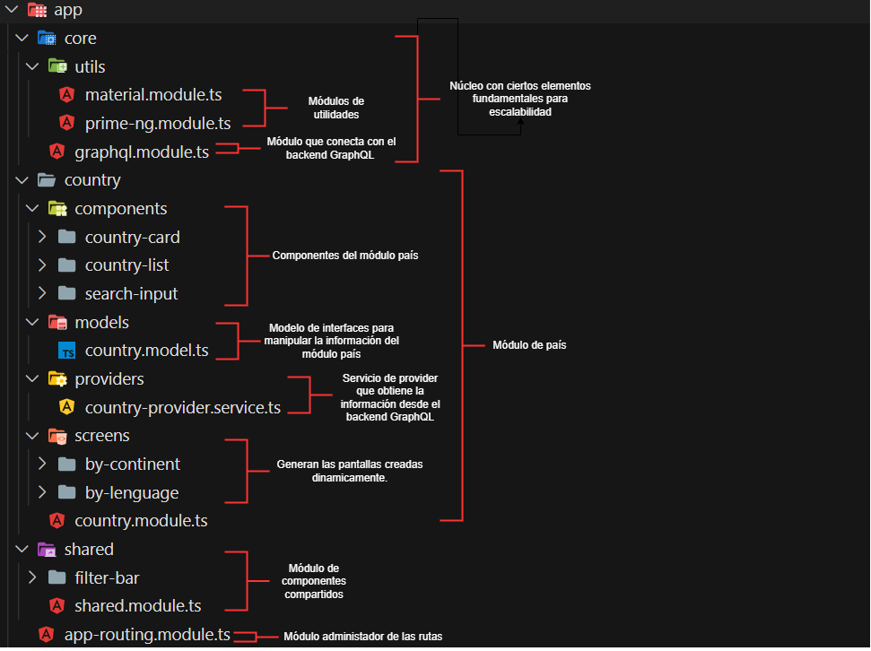

# KimcheChallenge | Desafío para Software Engineers

* **Nombre postulante:** Javier Ignacio del Canto Montenegro
* **Link a la app en producción:** https://kimchallenge.netlify.app/

## Explicación ejercicio

Consiste en un buscador de países utilizando un [grafo de paises](https://countries.trevorblades.com/). Agrupando los resultados de las busquedas por continentes o por lenguajes.

## Consideraciones que se tomaron

* Se utilizó el framework de [Angular CLI](https://angular.io/cli) debido a mi falta de conocimientos actuales sobre otros framework como React.

* Debido a que practicamente no sabía nada de GraphQL o Apollo, no pude elaborar queries óptimos según el schema aceptado por el [grafo de paises](https://countries.trevorblades.com/), por lo que tuve que ingeniarmela con servicios 'singleton' y el rendimiento puede no ser el mejor, sobre todo el la búsqueda agrupando por lenguajes.

## Estructura de la aplicación

La estructura interna de como se distibuye el código fuente se componene de la siguiente forma:

## Pregunta abierta a responder

"La tabla que contiene la información correspondiente a la asistencia diaria de un niño en un colegio tiene 90 millones de filas. Todas las tablas del sistema existen en la misma BDD en MySQL. La lógica del backend que actualiza la información correspondiente al pasar la asistencia tiene un tiempo de servicio p95 de 10 segundos. El equipo está interesado en bajar este tiempo para mejorar la experiencia del usuario (y porque nos gusta pensar en Kimche como un Ferrari). ¿Qué propondrías para enfrentar el problema? Esta pregunta es abierta, no hay respuestas malas. Puedes proponer arquitectura, tecnologías, diseño, etc."

**Respuesta:** 

Siendo sincero diría que actualmente no tengo la experiencia necesaria para plantearme una situación así, ya que 90 millones de filas solo en asistencias me parece excesivo, por lo que me da la impresión de que se acumulan desde hace mucho tiempo. La solución me parece que sería ir creando una nueva base de datos cada año de forma que no se acumule la información y las antiguas queden archivadas por si se necesitan. Lo otro también seria indexar las tablas para que obtener la información más rápido.

Otra solución se puede dar por tecnologías que no conozco actualmente.

## Palabras finales

Este ejercicio sirvió para entender ciertos fundamentos de tecnologías que no conocía, como GraphQL y Apollo, así como reforzar mis habilidades de programación web. Siendo que hace poco terminé mis estudios universitarios, soy consciente de que recién estoy comenzando, por lo que me gustaría optar a este empleo y desarrollarme profesionalmente, aunque sea como desarrollador trainee o algo similar.